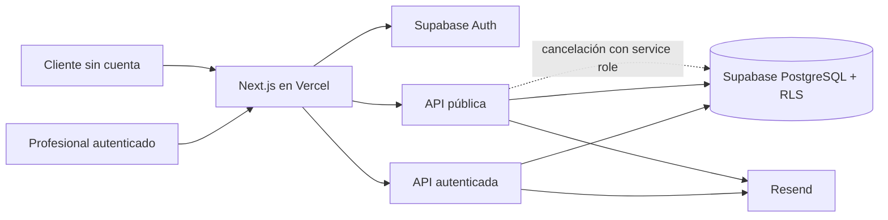

# Diseño del Sistema y Arquitectura: Cita AI

## 1. Stack Tecnológico

| Capa | Tecnología | Justificación |
| :--- | :--- | :--- |
| Aplicación web | Next.js App Router + TypeScript (`strict: false`) | Stack existente que sirve UI y rutas API en un único despliegue. |
| UI | Tailwind, Radix, Lucide, React Hook Form y Zod | Componentes, estilos y validación documentados en la implementación actual. |
| Fechas | date-fns con locale español | Biblioteca actual para cálculo y presentación de fechas. |
| Backend y datos | Supabase: PostgreSQL, Auth, cliente tipado y RLS | Backend administrado sin servidor propio ni ORM. |
| Correo | Resend para producto; Supabase para autenticación | Decisión posterior al borrador funcional y previa al soft launch. |
| Hosting | Vercel | Deploy automático del monolito Next.js al hacer push a `main`. |

## 2. Diagrama de Arquitectura (Mermaid)

## 3. Modelo de Datos (Preliminar)

- **professionals:** `id` compartido con `auth.users`, `name`, `email`, `slug`, `appointment_duration_minutes`, `created_at`.
- **clients:** `id`, `name`, `email`, `created_at`; `email` es único globalmente, no por profesional.
- **appointments:** `id`, `professional_id`, `client_id`, `start_time`, `end_time`, `status`, `created_at`; estado permitido `confirmed|cancelled`.
- **availability_rules:** `id`, `professional_id`, `day_of_week` (`0` domingo a `6` sábado), `start_time`, `end_time`, `created_at`.
- **time_blocks:** `id`, `professional_id`, `start_time`, `end_time`, `reason`, `created_at`; `reason` no se usa en UI según las notas.
- **Relaciones:** profesional 1:N turnos, reglas y bloqueos; cliente 1:N turnos. El conteo freemium obtiene clientes únicos por profesional mediante `appointments`.
- **Riesgos del modelo:** cliente global compartido, falta de transacción de reserva, schema no versionado, ausencia de índices documentados para el conteo y timestamps con zona horaria no resuelta.

## 4. Diseño de Interfaces (APIs)

- **Estilo:** REST mediante Route Handlers de Next.js.
- **Autenticadas:** `GET /api/appointments`, `GET /api/clients`, `PUT /api/professionals/settings`, `POST /api/availability/rules`, `GET|POST|DELETE /api/availability/blocks`, `POST /api/appointments/[id]/cancel`.
- **Públicas:** `GET /api/public/availability`, `POST /api/public/appointments`, `POST /api/public/appointments/[id]/cancel`.
- **Seguridad:** sesión Supabase y RLS para operaciones privadas; insert público para clientes/turnos; service role en cancelación pública. El identificador único de cancelación descrito funcionalmente no coincide con la advertencia técnica de que adivinar un ID permitiría cancelar: requiere revisión.
- **Rutas UI observadas:** `/dashboard`, `/dashboard/availability` y `/dashboard/clients`. La navegación autenticada no expone otras secciones ni un enlace al perfil público.

## 5. Decisiones de Arquitectura (ADRs)

- **ADR-01 — Monolito Next.js administrado:** mantener UI y API juntas. Favorece velocidad de entrega, pero acopla deploy, ejecución síncrona de correos y operación.
- **ADR-02 — Slots derivados:** calcular disponibilidad desde reglas menos turnos confirmados y bloqueos. Evita persistir slots, pero exige optimización al crecer y no soporta cruces de medianoche.
- **ADR-03 — Supabase con RLS:** delegar Auth y persistencia al servicio. Reduce infraestructura propia, pero las excepciones con service role deben auditarse.
- **ADR-04 — Límite freemium en código:** conservar `FREE_PLAN_CLIENT_LIMIT = 10` como estado actual. Cambiarlo requiere código y redeploy; no hay configuración comercial.
- **ADR-05 — Brechas prioritarias:** una transacción PostgreSQL para reserva, migraciones versionadas, dominio verificado y ejecución programada de recordatorios son recomendaciones, no componentes existentes.
- **Hallazgo de sesión:** la UI cambia a navegación anónima después de logout, pero las rutas privadas continúan renderizando. La existencia del middleware documentado no demuestra protección efectiva; debe verificarse autorización tanto en servidor como en APIs.

## 6. Estrategia de Testing (Shift-Left)

- **Estado actual:** no hay tests ni pipeline documentados.
- **Unit:** generación de slots, slugs, límite freemium, validaciones y conversiones de zona horaria.
- **Integración:** RLS, aislamiento entre profesionales, reserva atómica, cancelación pública, persistencia y errores de correo.
- **E2E:** login/registro, agenda, reserva, cancelación y límite con Playwright en un entorno aislado.
- **Contrato/seguridad:** autorización de cada endpoint, enumeración de cuentas, tokens de cancelación y acceso después de logout.
- Esta estrategia es **recomendación**; no debe ejecutarse contra producción ni interpretarse como cobertura existente.

## Fuentes

| Dato / afirmación | De dónde sale |
| :--- | :--- |
| Stack, modelo, endpoints, Auth, RLS y deuda | `.context/Confluence-corporativo/04-notas-tecnicas.md` · Stack, tablas, RLS, auth, endpoints y Lo que no está hecho |
| Alcance y riesgos funcionales | `.context/architecture/prd.md` · Core Features, NFRs y Riesgos |
| Resend como proveedor actual del producto | `.context/Confluence-corporativo/05-hilo-mail-cambio-de-alcance.md` · mail del 28/02/2026 |
| Rutas UI, navegación y comportamiento posterior a logout | **Observado** — producción, 30/08/2026 mediante Playwright; sin escrituras ni lectura de respuestas API |
| Arquitectura visual | **Derivado** — representación de los componentes documentados, no diagrama existente |
| Transacción, migraciones y estrategia de testing | **Hipótesis/recomendación** — no están implementadas ni acordadas |

## Contradicciones detectadas

- SendGrid aparece en kickoff, Supabase en el borrador funcional/notas antiguas y Resend en el hilo posterior. Se toma Resend para correos de producto y Supabase para Auth.
- El PRD requiere ausencia de superposición; la implementación no usa transacción y no garantiza atomicidad. Se registra como deuda.
- La especificación describe enlace único de cancelación; las notas advierten cancelación por ID con service role. No se declara seguridad suficiente hasta revisar el código.
- Las notas técnicas describen UAT separado; la nota QA posterior indica que ya no se usa. El diagrama representa producción, no una topología multiambiente.
- Las notas técnicas afirman protección de dashboard en `middleware.ts`; la exploración posterior al logout mostró las rutas renderizadas sin sesión. No se inspeccionó código ni se intentaron operaciones para determinar si la exposición alcanza datos/API.

## Preguntas abiertas

- ¿La cancelación pública usa un token impredecible o el ID del turno?
- ¿Cómo se almacenan e interpretan zonas horarias y timestamps?
- ¿Quién aprobará la migración a reserva transaccional y schema versionado?
- ¿Dónde se ejecutarán recordatorios y tareas asíncronas?
- ¿Qué observabilidad, backups, recuperación y SLO se requieren?
- ¿Existe acceso al código fuente para validar estas notas técnicas?
- ¿Las páginas privadas se renderizan estáticamente sin datos, conservan estado cliente o realmente permiten lecturas sin autenticación?
- ¿Qué debería hacer “Nuevo Cliente” y qué componente o endpoint falta para completar el flujo?

## Próximo paso

Continuar con `.prompts/3-Infraestructura/environment-analysis.md`.
