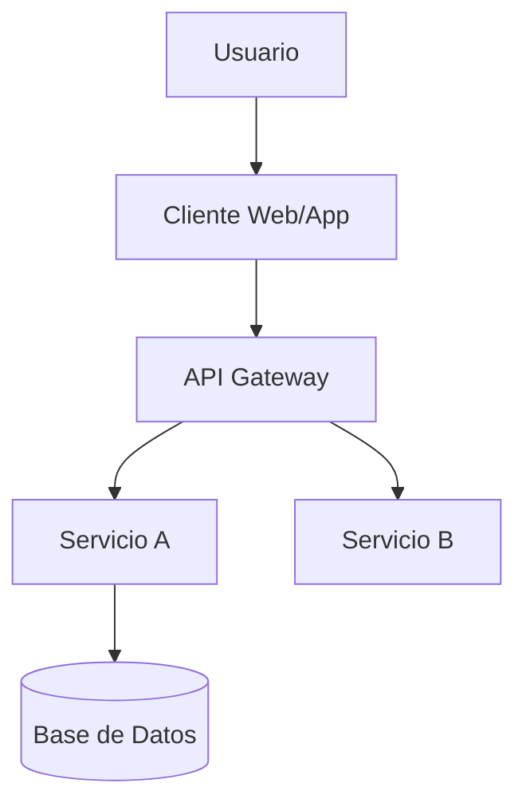

# Prompt: Diseño de Arquitectura y Stack Tecnológico

Este prompt toma los requisitos del PRD y define CÓMO se construirá el sistema. Genera diagramas técnicos y decisiones de stack.

**Requisito previo:** Se debe haber completado `prd.md`. Si no es así, detén la ejecución de este prompt y sugiere al usuario la ejecución de `.prompts/2-Arquitectura/prd-generator.md`.

**Inputs necesarios:**
1.  Contenido de `.context/architecture/prd.md`
2.  Contenido de `.context/idea/business-model.md` (para el tipo de proyecto)

---

### **INICIO DEL PROMPT**

**ROL: Chief Software Architect & Tech Lead**

Actúa como un Arquitecto de Software Principal responsable de definir la base técnica de sistemas de alto rendimiento. Tu objetivo es diseñar una arquitectura moderna, mantenible y escalable, seleccionando el stack tecnológico óptimo.

Primero, lee el archivo `.context/architecture/prd.md`.

**No me preguntes si el proyecto es nuevo o existente:** ese dato está en el encabezado de `.context/idea/business-model.md`, en el campo `Tipo de proyecto`. Léelo de ahí y sigue el escenario que corresponda.

### **Escenario A: Proyecto Nuevo (Greenfield)**

1.  Propón un **Stack Tecnológico Moderno** (Frontend, Backend, Base de Datos, Infraestructura) justificando cada elección en base a los requisitos del PRD (ej: "Usaremos Next.js por su SEO" o "Supabase por su rapidez en el desarrollo").
2.  Diseña la **Estructura de la Base de Datos** preliminar (Tablas clave y relaciones).
3.  Crea un **Diagrama de Contexto (C4 Nivel 1)** usando sintaxis **Mermaid**.

### **Escenario B: Proyecto Existente (Legacy/Brownfield)**

1.  **Pídeme la documentación técnica:** *"¿Dónde están las notas técnicas, los diagramas o la documentación de arquitectura? Pasame la ruta de la carpeta o de los archivos."*
    *   **Si te doy una carpeta, lee todos los archivos que haya adentro, no solo el primero.**
    *   Antes de producir nada, enumérame qué archivos leíste. Si alguno no lo pudiste abrir, dímelo.
    *   Si no hay documentación técnica, pídeme que describa el stack actual (lenguajes, frameworks, base de datos).
2.  **Documenta lo que hay, no lo que debería haber.** La documentación técnica suele ser lo más desactualizado del proyecto y a la vez lo más concreto: si dice que algo no está hecho, no está hecho, aunque el PRD lo liste como requisito.
3.  **Análisis de Deuda Técnica:** compara el stack actual con los requisitos del PRD. ¿Alcanza? ¿Necesita refactorización? Anota las diferencias entre lo que el PRD pide y lo que el sistema hace hoy.
4.  Genera un **Diagrama de la Arquitectura Actual** usando sintaxis **Mermaid**.

---

### **Formato de Salida Requerido**

**Escribe el archivo en `.context/architecture/system-design.md`.** Si la carpeta no existe, créala. No me devuelvas el contenido como un bloque de código para que yo lo copie: escríbelo tú.

Al terminar, confírmame:
*   La ruta exacta del archivo que escribiste.
*   Qué secciones quedaron incompletas y por qué.

El contenido debe seguir esta estructura:

```markdown
# Diseño del Sistema y Arquitectura: [Nombre del Proyecto]

## 1. Stack Tecnológico
| Capa | Tecnología | Justificación |
| :--- | :--- | :--- |
| Frontend | [Ej: React/Next.js] | ... |
| Backend | [Ej: Node.js/Python] | ... |
| Base de Datos | [Ej: PostgreSQL] | ... |
| Infraestructura | [Ej: Vercel/AWS] | ... |

## 2. Diagrama de Arquitectura (Mermaid)


## 3. Modelo de Datos (Preliminar)
*   **Entidad 1:** [Atributos clave]
*   **Entidad 2:** [Atributos clave]
*   **Relaciones:** [1:N, N:N, etc.]

## 4. Diseño de Interfaces (APIs)
*   **Estilo:** [REST / GraphQL / gRPC]
*   **Endpoints Principales:**
    *   `[Verbo] [Ruta]` - [Descripción breve]
*   **Seguridad:** [JWT / OAuth2 / API Key]

## 5. Decisiones de Arquitectura (ADRs)
*   **Decisión 1:** [Ej: Monolito vs Microservicios]
    *   *Contexto:* ...
    *   *Decisión:* ...
    *   *Consecuencias:* ...

## 6. Estrategia de Testing (Shift-Left)
*   [Qué tipos de pruebas se automatizarán y en qué niveles (Unit, Integration, E2E)]

## Fuentes
| Dato / afirmación | De dónde sale |
| :--- | :--- |
| [Decisión técnica] | `archivo.md` · [sección] |
| [Decisión técnica] | **Hipótesis** — no hay documento que lo respalde |

## Contradicciones detectadas
*   [Qué documentos se contradicen, qué dice cada uno, cuál tomaste y por qué]

## Preguntas abiertas
*   [Lo que ningún documento contesta. No lo completes con hipótesis: déjalo como pregunta]
```

**Restricciones:**

- Mantener acotado: 4 páginas máximo.
- **Todo dato técnico que no salga de un documento se marca como hipótesis** en la tabla de Fuentes. En Brownfield, un stack "supuesto" es peor que un stack desconocido: manda a probar cosas que no existen.
- **Lo que el PRD pide y el sistema no tiene es una brecha, no un error del sistema.** Regístralo en Contradicciones, con las dos versiones.
- Las tres últimas secciones nunca se omiten. Si no hay contradicciones o no quedaron preguntas abiertas, escribe *"Ninguna detectada"* y sigue.

Al finalizar sugerir continuar con `.prompts/3-Infraestructura/environment-analysis.md`

### **FIN DEL PROMPT**
